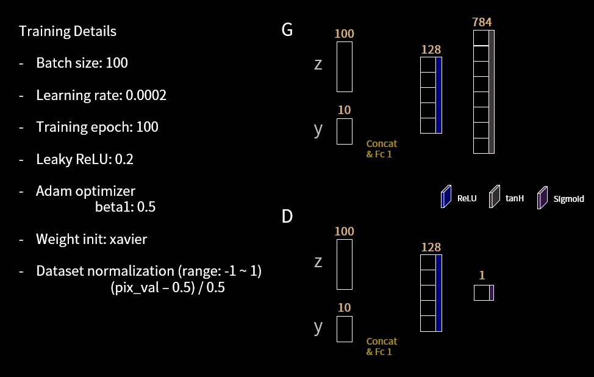
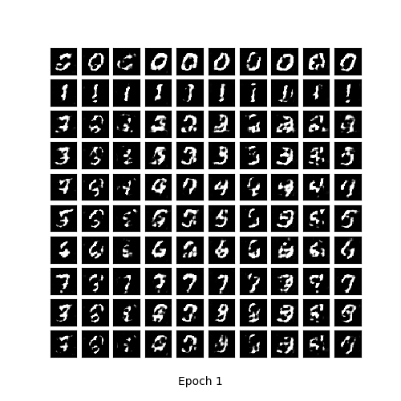
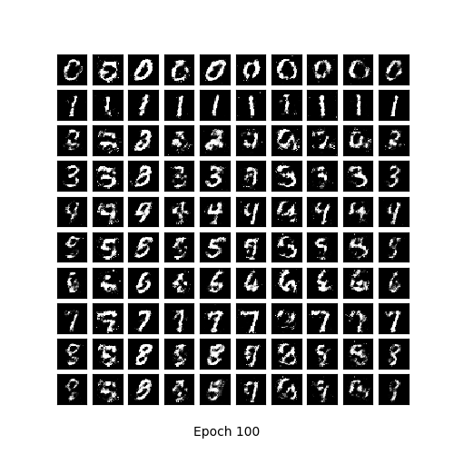
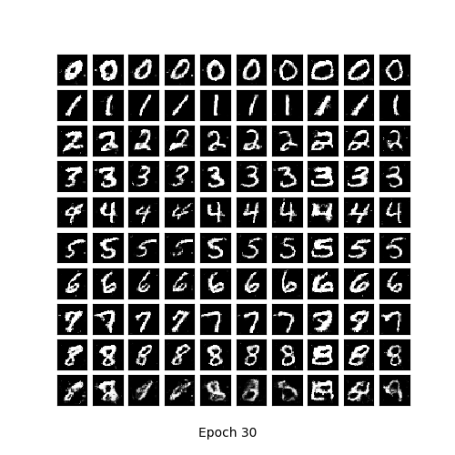
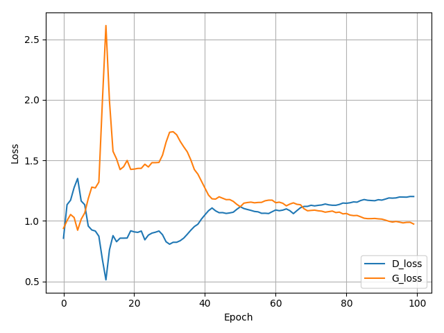
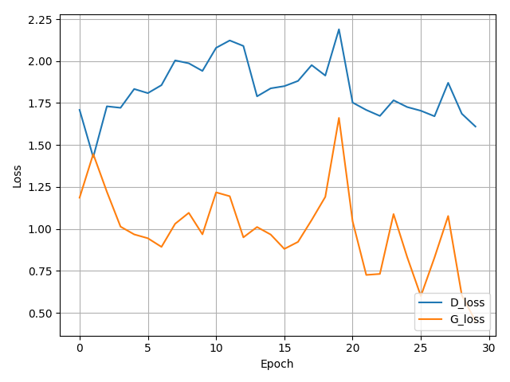

# tensorflow-MNIST-cGAN-cDCGAN
Tensorflow implementation of conditional Generative Adversarial Networks (cGAN) [1] and conditional Deep Convolutional Generative Adversarial Networks (cDCGAN) for MANIST [2] dataset.

* you can download
  - MNIST dataset: http://yann.lecun.com/exdb/mnist/
 
 ## Implementation details
* cGAN

 
## Resutls
* Generate using fixed noise (fixed_z_)

<table align='center'>
<tr align='center'>
<td> cGAN </td>
<td> cDCGAN </td>
</tr>
<tr>
<td>
<td>
</tr>
</table>

* MNIST vs Generated images

<table align='center'>
<tr align='center'>
<td> MNIST </td>
<td> cGAN after 100 epochs </td>
<td> cDCGAN after 30 epochs </td>
</tr>
<tr>
<td>
<td>
<td>
</tr>
</table>

* Training loss

<table align='center'>
<tr align='center'>
<td> cGAN </td>
<td> cDCGAN </td>
</tr>
<tr>
<td>
<td>
</tr>
</table>

* Learning time
    * MNIST cGAN - Avg. per epoch: 3.21 sec; Total 100 epochs: 1800.37 sec
    * MNIST cDCGAN - Avg. per epoch: 53.07 sec; Total 30 epochs: 2072.29 sec

## Development Environment

* Windows 7
* GTX1080 ti
* cuda 8.0
* Python 3.5.3
* tensorflow-gpu 1.2.1
* numpy 1.13.1
* matplotlib 2.0.2
* imageio 2.2.0

## Reference

[1] Mirza, Mehdi, and Simon Osindero. "Conditional generative adversarial nets." arXiv preprint arXiv:1411.1784 (2014).

(Full paper: https://arxiv.org/pdf/1411.1784.pdf)

[2] Y. LeCun, L. Bottou, Y. Bengio, and P. Haffner. "Gradient-based learning applied to document recognition." Proceedings of the IEEE, 86(11):2278-2324, November 1998.
